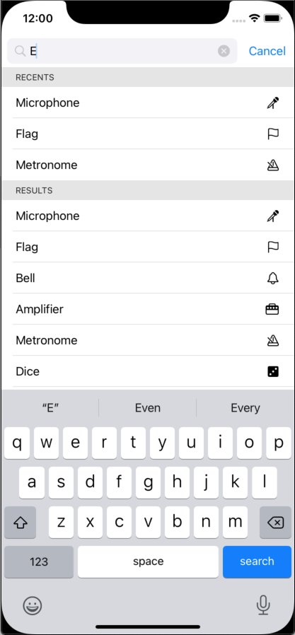

# SearchBar

A SwiftUI implementation of Search Controller functionality.
Currently only tried out on iOS, requires iOS 14 upwards



## Installation

### Swift Package Manager

In Xcode:
* File ⭢ Swift Packages ⭢ Add Package Dependency...
* Use the URL https://github.com/franklynw/SearchBar


## Example

> **NB:** All examples require `import SearchBar` at the top of the source file

This example is using a custom content type, so it can display icons as well as the search text (requires Combine as well) -

```swift
class MainViewModel: SearchBarShowing {
    
    typealias SearchListItemType = SearchItem
    
    private var subscriptions = Set<AnyCancellable>()
    
    @Published var searchResults: [SearchItemInfo] = []
    @Published var recentSearchSelections: [SearchItemInfo] = []
    @Published var selectedSearchTerm = ""
    
    private var _searchTerm: String = ""
    var searchTerm: Binding<String> {
        Binding<String>(
            get: { self._searchTerm },
            set: {
                
                self._searchTerm = $0
                
                withAnimation {
                    if self._searchTerm.isEmpty {
                        self.searchResults = []
                        self.recentSearchSelections = []
                    } else {
                        self.fetchSearchResults(using: self._searchTerm) {
                            self.searchResults = $0
                        }
                    }
                }
            }
        )
    }
    
    init() {
        
        $selectedSearchTerm
            .sink {
                print("Selected: ", $0)
            }
            .store(in: &subscriptions)
            
        recentSearchSelections = ...
    }
}


struct MainView: View {
    
    @ObservedObject private var viewModel: MainViewModel
    
    
    init(viewModel: MainViewModel) {
        self.viewModel = viewModel
    }
    
    var body: some View {
        
        SearchBar(viewModel)
            .placeHolder("Search for something")
    }
}

struct SearchItem: View, SearchBarListItem {
    
    private let content: SearchItemInfo
    private let textColor: Color
    
    init(content: SearchItemInfo, textColor: Color?) {
        self.content = content
        self.textColor = textColor ?? Color(.label)
    }
    
    var body: some View {
        HStack {
            Text(content.name)
                .foregroundColor(textColor)
            Spacer()
            Image(systemName: content.systemImageName)
        }
    }
}

struct SearchItemInfo: SearchBarTermContaining {
    let name: String
    let systemImageName: String
    
    init(_ name: String, _ systemImageName: String) {
        self.name = name
        self.systemImageName = systemImageName
    }
    
    var searchTerm: String {
        return name
    }
}
```


Available modifiers -

### Placeholder

You can set the search field's placeholder text

```swift
SearchBar(viewModel)
    .placeHolder("Search for something")
```

### Recents section title

Sets the title of the "Recents" section of the results - if not used, will default to "Recents"

```swift
SearchBar(viewModel)
    .recentsSectionTitle("Recently viewed items -")
```

### Results section title

Sets the title of the "Results" section of the results - if not used, will default to "Results"

```swift
SearchBar(viewModel)
    .resultsSectionTitle("Search results -")
```

### Search field text colour

The colour to use for the text in the search field - defaults to Color(.label) if unused

```swift
SearchBar(viewModel)
    .searchTextColor(.blue)
```

### Search field background colour

The colour to use for the search field's background - defaults to Color(.systemGray6) if unused

```swift
SearchBar(viewModel)
    .searchTextBackgroundColor(.gray)
```

### Search bar colour

The colour to use for the area surrounding the search field - defaults to Color(.systemBackground) if unused

```swift
SearchBar(viewModel)
    .searchBarBackgroundColor(.purple)
```

### Recent items text colour

The colour to use for the text of the recent items - defaults to Color(.label) if unused

```swift
SearchBar(viewModel)
    .recentsTextColor(.black)
```

### Recent items background colour

The colour to use for the background of the recents area of the results list - defaults to Color(.systemBackground) if unused

```swift
SearchBar(viewModel)
    .recentsBackgroundColor(.orange)
```

### Results items text colour

The colour to use for the text of the result items - defaults to Color(.label) if unused

```swift
SearchBar(viewModel)
    .resultsTextColor(.red)
```

### Results items background colour

The colour to use for the background of the results area of the results list - defaults to Color(.systemBackground) if unused

```swift
SearchBar(viewModel)
    .resultsBackgroundColor(.yellow)
```

### Cancel button colour

The colour to use for the Cancel button - defaults to Color(.link) if unused

```swift
SearchBar(viewModel)
    .cancelButtonColor(.red)
```

### Maximum number of recents

The maximum number of rows to show in the recents section - defaults to 3 if unused

```swift
SearchBar(viewModel)
    .maxRecents(5)
```

### Maximum number of search results

The maximum number of rows to show in the results section - defaults to unlimited if unused

```swift
SearchBar(viewModel)
    .maxResults(5)
```

### Additional padding above & below the search bar

Additional padding around the search field, split evenly top & bottom

```swift
SearchBar(viewModel)
    .verticalPadding(12)
```

### Disable dismiss on selection

Use this to prevent the default behaviour of dismissing the results list & resigning first responder from the search field when the user selects an item from the results

```swift
SearchBar(viewModel)
    .disableDismissOnSelection
```


## Dependencies

Requires InputAccessoryTextField, which is linked. GitHub page is [here](https://github.com/franklynw/InputAccessoryTextField).
Also uses FWCommonProtocols, but that comes with InputAccessoryTextField. GitHub page is [here](https://github.com/franklynw/FWCommonProtocols)


## License  

`SearchBar` is available under the MIT license
